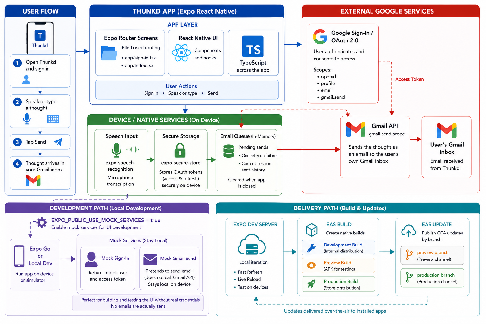

<div align="center">
  

  **⚡ Capture thoughts instantly and send them straight to your inbox 💭**
</div>

Thunkd is a single-screen Expo app for quickly capturing a thought by typing or speaking, then sending it to your own Gmail inbox.

It uses native Google Sign-In, the Gmail API, on-device speech recognition, secure token storage, and a small in-memory send queue for the current app session. Mock services are available for UI work in Expo Go or local development.

## Install

```bash
git clone https://github.com/tsilva/thunkd.git
cd thunkd
pnpm install
EXPO_PUBLIC_USE_MOCK_SERVICES=1 pnpm start
```

Scan the Expo QR code with Expo Go, or press `i`, `a`, or `w` in the Expo terminal to open iOS, Android, or web.

For real Google sign-in and Gmail sending, copy `.env.example` to `.env`, fill in the Google OAuth values, and run:

```bash
./scripts/setup-gcloud.sh
```

See [Google Cloud Setup](docs/google-cloud-setup.md) for the manual setup path and production verification notes.

## Commands

```bash
pnpm start       # start the Expo dev server
pnpm android     # open on an Android emulator
pnpm ios         # open on an iOS simulator
pnpm web         # run the web target
pnpm lint        # run Expo lint checks

eas build --platform android --profile development  # Android dev build
eas build --platform android --profile preview      # Android preview APK
eas build --platform all --profile production       # production builds
eas update --branch preview --message "message"     # preview OTA update
eas update --branch production --message "message"  # production OTA update
```

## Notes

- This repo declares `pnpm@10.27.0` in `package.json` and rejects non-pnpm installs in `preinstall`.
- Voice capture uses `expo-speech-recognition`, so it needs a development build for real native speech input; Expo Go is best used with mock services.
- Google OAuth needs `EXPO_PUBLIC_GOOGLE_WEB_CLIENT_ID` and `EXPO_PUBLIC_GOOGLE_WEB_CLIENT_SECRET`; `gmail.send` is a sensitive scope and requires Google verification before broader production use.
- `EXPO_PUBLIC_USE_MOCK_SERVICES=1` enables mocked sign-in and mocked Gmail sends. Optional mock identity values are `EXPO_PUBLIC_MOCK_USER_EMAIL` and `EXPO_PUBLIC_MOCK_USER_NAME`.
- Sent history and queued messages are kept in memory for the current app session. OAuth tokens are stored with `expo-secure-store`, with a web localStorage fallback.
- EAS is configured for development, preview, and production builds in `eas.json`; the Android production submit profile expects `service-account-play-store.json`.

## Architecture



## License

[MIT](LICENSE) © Tiago Silva
