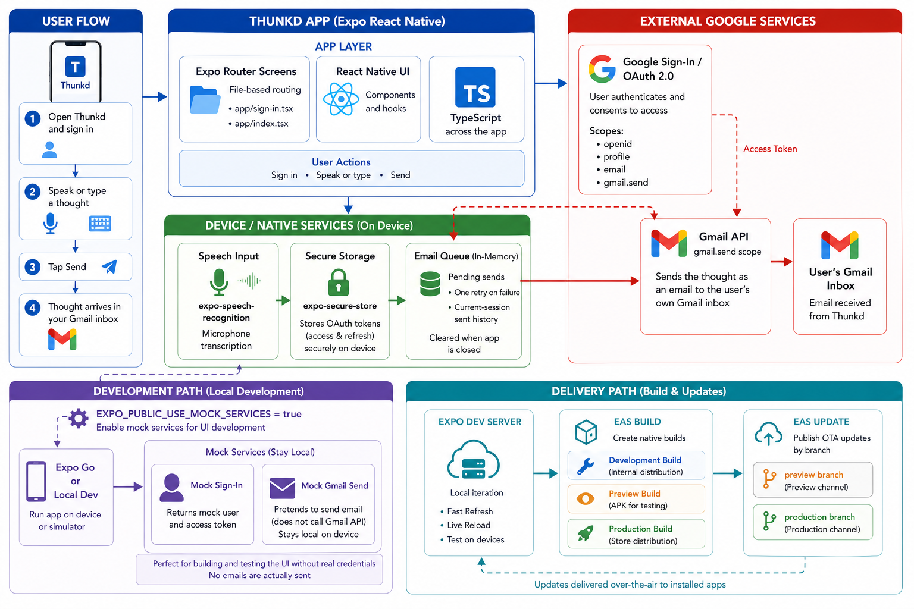

<p align="center">
  
  <br />
  <!-- repo-tagline:start -->
  <strong>⚡ Capture thoughts instantly and send them straight to your inbox 💭</strong>
  <!-- repo-tagline:end -->
</p>

Thunkd is a single-screen Expo app for quickly capturing a thought by typing or speaking, then sending it to your own Gmail inbox.

It includes on-device speech recognition and a small in-memory send queue for the current app session. Mock authentication and Gmail services are available for UI work in Expo Go or local development. Live Google sign-in is disabled until OAuth token exchange is moved server-side.

## Install

```bash
git clone https://github.com/tsilva/thunkd.git
cd thunkd
pnpm install
EXPO_PUBLIC_USE_MOCK_SERVICES=1 keyenv run -- pnpm start
```

Scan the Expo QR code with Expo Go, or press `i`, `a`, or `w` in the Expo terminal to open iOS, Android, or web.

The Google Cloud helper remains available for project and client-ID setup:

```bash
./scripts/setup-gcloud.sh
```

Do not add an OAuth client secret to `.env` or any `EXPO_PUBLIC_*` variable. See [Google Cloud Setup](docs/google-cloud-setup.md) for the current mock-development path and the server-side requirement for restoring live auth.

Private local values declared in `.keyenv.toml` live in macOS Keychain. Check them with `keyenv doctor` and launch commands through `keyenv run -- ...`; application code continues to read normal environment variables.

## Commands

```bash
pnpm start       # start the Expo dev server
pnpm android     # open on an Android emulator
pnpm ios         # open on an iOS simulator
pnpm web         # run the web target
pnpm lint        # run Expo lint checks
pnpm security:test # check dependency fixes and normal parsing/signing behavior

eas build --platform android --profile development  # Android dev build
eas build --platform android --profile preview      # Android preview APK
eas build --platform all --profile production       # production builds
eas update --branch preview --message "message"     # preview OTA update
eas update --branch production --message "message"  # production OTA update
```

## Notes

- This repo declares `pnpm@10.27.0` in `package.json`, commits `pnpm-lock.yaml`, and rejects non-pnpm installs in `preinstall`.
- Voice capture uses `expo-speech-recognition`, so it needs a development build for real native speech input; Expo Go is best used with mock services.
- Live Google sign-in is temporarily disabled while OAuth token exchange moves to a server-side flow. Mock sign-in and mock Gmail sends remain available with `EXPO_PUBLIC_USE_MOCK_SERVICES=1`.
- `EXPO_PUBLIC_USE_MOCK_SERVICES=1` enables mocked sign-in and mocked Gmail sends. Optional mock identity values are `EXPO_PUBLIC_MOCK_USER_EMAIL` and `EXPO_PUBLIC_MOCK_USER_NAME`.
- Sent history and queued messages are kept in memory for the current app session. Mock auth state is stored with `expo-secure-store`, with a web localStorage fallback.
- EAS is configured for development, preview, and production builds in `eas.json`; the Android production submit profile expects `service-account-play-store.json`.

## Dependency security

The pinned pnpm install applies reviewed source patches to `image-size`, `node-forge` and `braces`. The Forge patch follows [upstream PR 1152](https://github.com/digitalbazaar/forge/pull/1152) at `ceba34402e329f0365134f23fe19898756527d65`: RSA verification rejects extra nested DigestInfo fields while retaining valid AlgorithmIdentifier forms. Brace parsing and AST operations reject nesting at 128 levels and cyclic ASTs with `BRACES_MAX_DEPTH`; normal globs, escapes and ranges remain supported.

Istanbul's NYC configuration loader resolves `js-yaml` 4.3.2, removing its older YAML/`sprintf-js` path. `pnpm security:test` checks that loader and the actual Expo signing and glob dependencies. No audit threshold or advisory allowlist was weakened. Version-based audits and Dependabot may continue to flag the two unreleased Forge/Braces advisories even with these local patches; source regression checks and normal CI must be considered alongside those still-open alerts. Replace the backports with upstream releases after their compatibility and release age are verified.

## Architecture



## License

[MIT](LICENSE) © Tiago Silva
